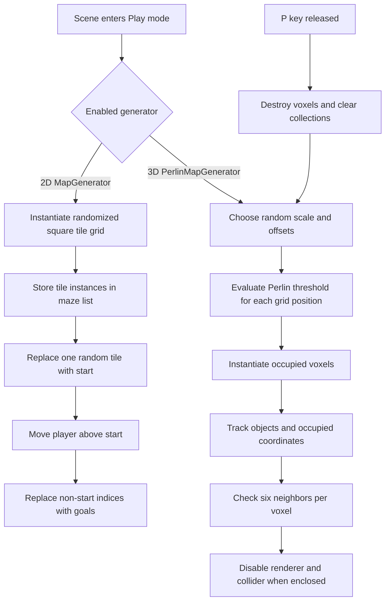

# Procedural Generation Experiments

An educational Unity systems sample containing two separate procedural-generation experiments: a randomized 2D tile maze and a 3D voxel terrain shaped by Perlin noise. The repository is intended to demonstrate the authored C# systems and their data flow, not a finished game.

## Requirements

- Unity `6000.0.34f1` (the exact version recorded in `ProjectSettings/ProjectVersion.txt`)
- A desktop environment supported by that Unity editor version

No verified standalone build is committed. Open the project in the Unity Editor.

## Experiments

### Randomized 2D tile maze

`MapGenerator` fills a square grid by randomly selecting from two regular tile prefabs and rotating each tile in 90-degree increments. It stores every instantiated tile in a list, then:

1. selects one random list index for the start tile;
2. replaces that tile and moves the player ten units above it; and
3. selects goal indices that cannot equal the start index and replaces those tiles.

The committed `MapGenerator` prefab is configured with a map size of 16 and tile spacing of 16. `SampleScene` overrides the goal count to 3. Goal selections are not tracked for uniqueness, so repeated indices can produce fewer than three distinct goal locations.

### Perlin voxel terrain

`PerlinMapGenerator` samples random noise scale and coordinate offsets, then evaluates a Perlin-height threshold across a 3D grid. Generated voxels are tracked in both:

- a `List<GameObject>` for later traversal and destruction; and
- a `HashSet<Vector3Int>` for constant-time occupancy queries.

After generation, each voxel checks its six axis-aligned neighbors. A voxel fully enclosed on all sides keeps its data and occupancy but has its `MeshRenderer` and `BoxCollider` disabled, reducing rendering and collision work for hidden interior cells.

The committed `ProceduralGeneratedMap` scene configures a `32 x 32 x 32` grid and a random noise-scale range of 16 to 24.

## Architecture and data flow



## Open and run

1. In Unity Hub, add this repository folder as a project.
2. Open it with Unity `6000.0.34f1` and allow package import to finish.
3. Run one experiment:
   - **3D terrain:** open `Assets/Scenes/ProceduralGeneratedMap.unity` and enter Play mode. The committed scene has `PerlinMapGenerator` enabled and the `MapGenerator` component disabled. Release `P` to clear and regenerate the terrain.
   - **2D maze:** open `Assets/Scenes/SampleScene.unity`, select the inactive `MapGenerator` prefab instance in the Hierarchy, activate it in the Inspector, and enter Play mode. The committed scene intentionally stores this generator inactive.
4. Exit Play mode before changing scenes.

`SampleScene` is the only enabled scene in `ProjectSettings/EditorBuildSettings.asset`; these instructions use direct scene opening so each experiment's committed setup is explicit.

## Controls and configuration

### 2D maze (`MapGenerator`)

- `regularTiles`: candidate prefabs selected randomly for each grid cell
- `goalTile` / `startTile`: replacement prefabs
- `mapSize`: square grid side length; total regular cells are `mapSize * mapSize`
- `tileSize`: world-space spacing between cells
- `numberOfGoalTiles`: number of replacement attempts

### 3D terrain (`PerlinMapGenerator`)

- `width`, `height`, `depth`: sampled voxel-grid dimensions
- `min`, `max`: bounds used to choose a random Perlin scale
- `tileParent`: parent transform for generated voxels
- `threeDTile`: instantiated voxel prefab
- `P`: regenerate while in Play mode

### Player and camera

The player uses Unity's legacy input API: `Horizontal` and `Vertical` axes move, the configured `Jump` button jumps, and `Mouse X` / `Mouse Y` rotate the view. Movement values, gravity, jump height, ground detection, and mouse sensitivity are exposed on their respective components.

## Complexity

- **2D generation:** `O(n^2)` time and `O(n^2)` retained object/list space for a side length `n`; start and goal replacement adds `O(g)` expected work for `g` goal attempts.
- **3D generation:** `O(width * height * depth)` noise evaluations. If `v` voxels are occupied, enclosure processing is `O(v)` because each voxel performs six average-constant-time hash lookups. Runtime storage is `O(v)`.
- **Regeneration:** destroying and clearing the previous voxel set is `O(v)`, followed by another full 3D generation pass.

## Repository map

```text
Assets/
  _Scripts/             Core player, camera, and procedural systems
  Scenes/               Separate committed experiment scenes
  Prefabs/              Tile, generator, goal, start, and voxel prefabs
  Materials/            Unity material assets
  Models/               Imported model assets
  Textures/             Imported texture assets
  RenderPipeline/       Universal Render Pipeline configuration
Packages/               Unity Package Manager manifest and lock data
ProjectSettings/        Unity editor and project configuration
```

### Authored C# files

- `Assets/_Scripts/MapGenerator.cs` — randomized 2D grid, start placement, and goal replacement
- `Assets/_Scripts/PerlinMapGenerator.cs` — Perlin voxel generation, occupancy tracking, and enclosed-voxel optimization
- `Assets/_Scripts/PlayerBehaviour.cs` — first-person movement, jumping, gravity, and ground checks
- `Assets/_Scripts/CameraController.cs` — mouse-look camera control
- `Assets/AgentBehavior.cs` — NavMesh agent pursuit behavior

## Limitations and scope

- This is an educational prototype, not a polished game.
- The experiments are separate scene configurations rather than one integrated gameplay loop.
- Input code uses Unity's legacy `Input` API despite the project also declaring the newer Input System package.
- There are no automated tests.
- Unity was not available for this repository cleanup, so no editor compilation, Play mode test, or standalone build has been verified.
- The goal-selection loop prevents selecting the start tile but does not prevent duplicate goal selections.

## Asset provenance

Portfolio claims for this repository apply only to the authored code listed above. The repository also contains visual assets whose original authorship and redistribution terms cannot be verified from committed documentation; no claim of authorship or licensing is made for those assets. No repository-wide license is provided because ownership and provenance of all content have not been established.
